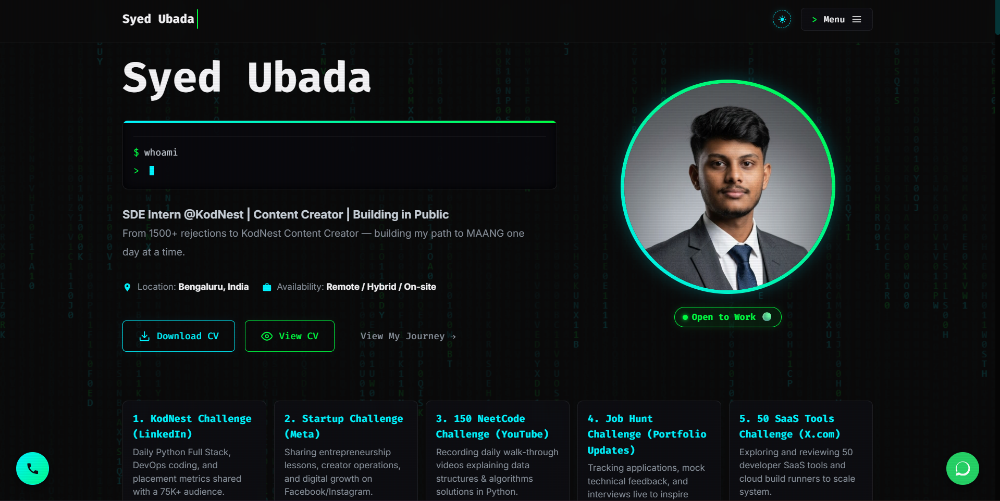

<!-- 1. FIGlet Big Name Banner -->
<pre>
<b>
 _   _ ____    ____ ___  ____  _____ ____  
| | | | __ )  / ___/ _ \|  _ \| ____/ ___| 
| | | |  _ \ | |  | | | | | | |  _| \___ \ 
| |_| | |_) || |__| |_| | |_| | |___ ___) |
 \___/|____/  \____\___/|____/|_____|____/ 
</b>
</pre>

<!-- 2. Tagline -->

<code>? Consistency is a Superpower | DevOps Engineer & Automation Enthusiast</code>

<!-- 3. Profile Visitor Counter Badge -->

  

 

<!-- 4. Click Me Heading & Official Brand Logos -->
<h3><code>$ click_me --connect</code></h3>

  
  &nbsp;&nbsp;&nbsp;&nbsp;
  
  &nbsp;&nbsp;&nbsp;&nbsp;
  
  &nbsp;&nbsp;&nbsp;&nbsp;
  

 

<!-- 5. Interactive Image Preview Card for Version 2 Portfolio -->
<h3><code>$ open https://syed-Ubada.vercel.app</code></h3>

?? Click image above to visit Live Portfolio v2

  

<!-- 6. Terminal System Info Section -->
<h3><code>$ whoami --verbose</code></h3>

<table border="0">
  <tr>
    <td align="center" valign="top" width="40%">
      
    </td>
    <td align="left" valign="top" width="60%">
      
    </td>
  </tr>
</table>

  

<!-- 7. Verified Tech Stack Matrix -->
<h3><code>$ list --tools --stack</code></h3>

<b>Core Languages & Scripting</b>

   &nbsp;
   &nbsp;
   &nbsp;
   &nbsp;
  

<b>DevOps, Cloud & Infrastructure</b>

   &nbsp;
   &nbsp;
   &nbsp;
   &nbsp;
   &nbsp;
  

<b>Developer Tools & Environment</b>

   &nbsp;
   &nbsp;
   &nbsp;
  

  

<!-- 8. Active Sprint Task Matrix -->
<h3><code>$ htop --filter active_sprint</code></h3>

<table border="1" style="border-collapse: collapse; width: 90%;">
  <tr>
    <th align="left">PID</th>
    <th align="left">TASK / FOCUS AREA</th>
    <th align="left">PROGRESS</th>
    <th align="left">STATUS</th>
  </tr>
  <tr>
    <td>101</td>
    <td><b>DSA Blind 75</b> (Python Implementation)</td>
    <td><code>[¦¦¦¦¦¦¦¦¦¦¦¦¦¦¦¦] 60%</code></td>
    <td>?? RUNNING</td>
  </tr>
  <tr>
    <td>102</td>
    <td><b>CI/CD Pipeline Optimization</b></td>
    <td><code>[¦¦¦¦¦¦¦¦¦¦¦¦¦¦¦¦] 85%</code></td>
    <td>?? RUNNING</td>
  </tr>
  <tr>
    <td>103</td>
    <td><b>K8s Cluster Manifest Automation</b></td>
    <td><code>[¦¦¦¦¦¦¦¦¦¦¦¦¦¦¦¦] 50%</code></td>
    <td>?? IN PROGRESS</td>
  </tr>
</table>

  

<!-- 9. Interactive Terminal Guestbook -->
<h3><code>$ gh issue create --label "guestbook"</code></h3>

<a href="https://github.com/ubada-devops/ubada-devops/issues/new?title=Guestbook+Entry%3A+Hello%21&body=Leave+a+message%2C+feedback%2C+or+just+say+hi%21+%F0%9F%91%8B" target="_blank">
  <table border="1" style="border-collapse: collapse; width: 90%;">
    <tr>
      <td align="center" padding="10">
        <code>$ echo "Leave your mark in the guestbook!"</code> 
        <b>?? Drop a Message / Sign Guestbook</b> 
        Click here to open a quick GitHub Issue & say hello ??
      </td>
    </tr>
  </table>
</a>

  

<!-- 10. Terminal Shutdown Footer -->

<code>$ shutdown -h now "Thanks for visiting! Keep building."</code>

