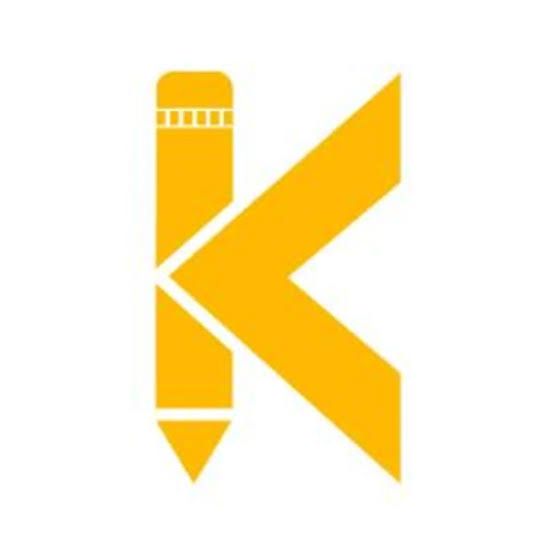

<pre>
<b>
 _   _ ____    ____ ___  ____  _____ ____  
| | | | __ )  / ___/ _ \|  _ \| ____/ ___| 
| | | |  _ \ | |  | | | | | | |  _| \___ \ 
| |_| | |_) || |__| |_| | |_| | |___ ___) |
 \___/|____/  \____\___/|____/|_____|____/ 
</b>
</pre>

  

  
  &nbsp;
  

  
  &nbsp;
  
  &nbsp;
  

  
  &nbsp;
  

 

<h3><code>$ click_me --connect</code></h3>

  
  &nbsp;&nbsp;&nbsp;&nbsp;
  
  &nbsp;&nbsp;&nbsp;&nbsp;
  
  &nbsp;&nbsp;&nbsp;&nbsp;
  

 

<h3><code>$ open https://syed-Ubada.vercel.app</code></h3>

Click image above to visit Live Portfolio v2

  

<h3><code>$ whoami --verbose</code></h3>

<table border="0">
  <tr>
    <td align="center" valign="top" width="40%">
      
    </td>
    <td align="left" valign="top" width="60%">
      
    </td>
  </tr>
</table>

  

<!-- ============ INFO SECTION: CAREER OBJECTIVE ============ -->
<h3><code>$ cat ~/objective.txt</code></h3>

&nbsp;

  
DevOps-focused engineer transitioning into full-stack + Gen AI development, aiming to land an SDE role at a MAANG-level company. Brings a systems/automation mindset to application development - comfortable across the deployment pipeline, not just the code.

  

<!-- ============ INFO SECTION: EDUCATION ============ -->
<h3><code>$ cat ~/education.log</code></h3>

<table border="1" style="border-collapse: collapse; width: 90%;">
  <tr>
    <th align="left">DEGREE</th>
    <th align="left">SPECIALIZATION</th>
    <th align="left">INSTITUTION</th>
  </tr>
  <tr>
    <td>
      
    </td>
    <td>
      
    </td>
    <td>Presidency University</td>
  </tr>
</table>

  

<!-- ============ INFO SECTION: CURRENT TRAINING ============ -->
<h3><code>$ systemctl status current-training</code></h3>

<table border="1" style="border-collapse: collapse; width: 90%;">
  <tr>
    <th align="left">PROGRAM</th>
    <th align="left">INSTITUTE LOGO</th>
    <th align="left">FORMAT & FOCUS</th>
  </tr>
  <tr>
    <td><b>Python Full Stack with Gen AI Tools</b></td>
    <td align="center">
      
    </td>
    <td>
      
       
      Python, Full Stack Dev, Generative AI tooling
    </td>
  </tr>
</table>

  

<!-- ============ INFO SECTION: JOURNEY TIMELINE ============ -->
<h3><code>$ git log --oneline --graph ~/career</code></h3>

   
  🎓 Graduated from Presidency University

   
  🔥 ~6 months self-directed search: 1,500+ applications, multiple final-round rejections

   
  ⚡ Python Full Stack with Gen AI Tools (Offline, Bangalore)

   
  📢 Documenting journey publicly on LinkedIn with daily updates

   
  🚀 Building full-stack projects, solving Blind 75 DSA, and grinding technical mocks

  

<h3><code>$ list --tools --stack</code></h3>

<b>Core Languages & Scripting</b>

   &nbsp;
   &nbsp;
   &nbsp;
   &nbsp;
  

<b>DevOps, Cloud & Infrastructure</b>

   &nbsp;
   &nbsp;
   &nbsp;
   &nbsp;
   &nbsp;
  

<b>Developer Tools & Environment</b>

   &nbsp;
   &nbsp;
   &nbsp;
  

<b>Deployed On</b>

  
  

  

<!-- ============ INFO SECTION: SKILLS MATRIX ============ -->
<h3><code>$ cat ~/skills_matrix.log</code></h3>

<table border="1" style="border-collapse: collapse; width: 90%;">
  <tr>
    <th align="left">AREA</th>
    <th align="left">SKILL</th>
    <th align="left">LEVEL</th>
  </tr>
  <tr>
    <td rowspan="2">Languages</td>
    <td>Python</td>
    <td></td>
  </tr>
  <tr>
    <td>JavaScript / HTML / CSS</td>
    <td></td>
  </tr>
  <tr>
    <td rowspan="3">DevOps</td>
    <td>Git & GitHub</td>
    <td></td>
  </tr>
  <tr>
    <td>Docker</td>
    <td></td>
  </tr>
  <tr>
    <td>Kubernetes</td>
    <td></td>
  </tr>
  <tr>
    <td>Foundations</td>
    <td>DSA (Arrays, Stack, Queue, Trees, Graphs)</td>
    <td></td>
  </tr>
</table>

Self-assessed levels - updated as skills develop through the KodNest track.

  

<!-- ============ INFO SECTION: PROJECT PORTFOLIO ============ -->
<h3><code>$ ls ~/projects --detailed</code></h3>

<table border="1" style="border-collapse: collapse; width: 90%;">
  <tr>
    <th align="left">PROJECT</th>
    <th align="left">STACK</th>
    <th align="left">DESCRIPTION</th>
    <th align="left">LINK</th>
  </tr>
  <tr>
    <td><b>Husni Amliyat Website</b></td>
    <td>
      
    </td>
    <td>Single-page site for a spiritual healer business - Islamic design motifs, 12 services, WhatsApp booking form, 3-language toggle (EN/KN/UR with RTL), WCAG AA contrast, PWA support</td>
    <td></td>
  </tr>
  <tr>
    <td><b>Portfolio v2</b></td>
    <td>
      
    </td>
    <td>Personal terminal-themed portfolio site</td>
    <td></td>
  </tr>
  <tr>
    <td><b>HRFlow (concept)</b></td>
    <td>
      
    </td>
    <td>HR/workforce-management concept for Indian SMBs (20-200 employees) underserved by spreadsheets - planned as a post-placement side project</td>
    <td></td>
  </tr>
</table>

  
  &nbsp;
  

  

<!-- ============ VISUAL ACTIVE SPRINTS ============ -->
<h3><code>$ htop --filter active_sprint</code></h3>

<table border="1" style="border-collapse: collapse; width: 90%;">
  <tr>
    <th align="left">PID</th>
    <th align="left">TASK / FOCUS AREA</th>
    <th align="left">VISUAL PROGRESS</th>
    <th align="left">STATUS</th>
  </tr>
  <tr>
    <td>101</td>
    <td><b>DSA Blind 75</b> (Python Implementation)</td>
    <td>
      
    </td>
    <td></td>
  </tr>
  <tr>
    <td>102</td>
    <td><b>CI/CD Pipeline Optimization</b></td>
    <td>
      
    </td>
    <td></td>
  </tr>
  <tr>
    <td>103</td>
    <td><b>K8s Cluster Manifest Automation</b></td>
    <td>
      
    </td>
    <td></td>
  </tr>
</table>

  

<!-- ============ VISUAL ROADMAP ============ -->
<h3><code>$ cat ~/roadmap.md</code></h3>

  
  &nbsp;
  

  
  &nbsp;
  

  
  &nbsp;
  

  

<!-- ============ VISUAL ACHIEVEMENTS LOG ============ -->
<h3><code>$ cat ~/achievements.log</code></h3>

  
   
  🚀 Grew "Learning in Public" series dynamically in under a month.

  
   
  💡 Chose DevOps as a fresher to stand out among application developers.

  
   
  🔥 Persisted through final round rejections to restart with structured training.

  

<!-- ============ VISUAL PHILOSOPHY ============ -->
<h3><code>$ cat ~/philosophy.txt</code></h3>

  
  &nbsp;
  
    
  Believes in learning in public - documenting progress daily rather than waiting until "ready." Approaches new tools with a systems/automation lens first, application logic second. Prioritizes placement readiness above side projects and freelancing until that goal is met.

  

<!-- ============ VISUAL AVAILABILITY ============ -->
<h3><code>$ cat ~/availability.conf</code></h3>

<table border="1" style="border-collapse: collapse; width: 90%;">
  <tr>
    <th align="left">STATUS</th>
    <th align="left">LOOKING FOR</th>
    <th align="left">BEST CONTACT</th>
  </tr>
  <tr>
    <td>
      
    </td>
    <td>
      
    </td>
    <td>
      
      &nbsp;
      
    </td>
  </tr>
</table>

  

<h3><code>$ ps aux | grep building</code></h3>

Currently shipping features on the KodNest Gen-AI Full Stack track, documenting the journey live on LinkedIn, and prepping for SDE interviews.

  

<h3><code>$ gh issue create --label "guestbook"</code></h3>

<a href="https://github.com/ubada-devops/ubada-devops/issues/new?title=Guestbook+Entry%3A+Hello%21&body=Leave+a+message%2C+feedback%2C+or+just+say+hi%21+%F0%9F%91%8B" target="_blank">
  <table border="1" style="border-collapse: collapse; width: 90%;">
    <tr>
      <td align="center" padding="10">
        <code>$ echo "Leave your mark in the guestbook!"</code> 
        <b>Drop a Message / Sign Guestbook 👋</b> 
        Click here to open a quick GitHub Issue & say hello
      </td>
    </tr>
  </table>
</a>

  

<!-- ============ VISUAL FAQ LOGO ============ -->
<h3></h3>

<b>What are you currently focused on?</b>

 
Landing an SDE role at a top-tier tech company, backed by daily DSA practice and hands-on DevOps projects.

<b>Are you open to freelance / collab work?</b>

 
Selectively - feel free to reach out via email or LinkedIn.

<b>Why DevOps + Full Stack together?</b>

 
Came in with a DevOps specialization from college, then added Python Full Stack + Gen AI training on top of it - the goal is to be someone who understands the whole delivery pipeline, not just application code.

  

<!-- ============ VISUAL CHANGELOG ============ -->
<h3><code>$ cat ~/CHANGELOG.md</code></h3>

  
   
  Last significant update: switched KodNest logo to local repo asset `./images.jpg` and removed unstable external stats/trophy widgets.

  

<!-- ============ THANK YOU EMOJI & FOOTER ============ -->

  

<code>$ shutdown -h now "Thanks for visiting! Keep building."</code>

  

