<h3><code>$ cat contributions.log</code></h3>

  

<h3><code>$ whoami --verbose</code></h3>

<table border="0">
  <tr>
    <td align="center" valign="top" width="45%">
      
    </td>
    <td align="left" valign="top" width="55%">
      
    </td>
  </tr>
</table>

